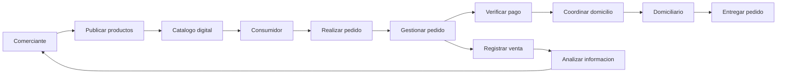

# Arquitectura Empresarial -- Caso de Estudio Sincelejo Comercio Digital

Este repositorio contiene el desarrollo de una **Arquitectura Empresarial utilizando el framework TOGAF (ADM)** para el caso de estudio de **Sincelejo Comercio Digital S.A.S.**, una propuesta de transformación digital enfocada en pequeños comerciantes y micronegocios de Sincelejo.

El objetivo es diseñar una arquitectura que permita **organizar e integrar los procesos de negocio, datos, aplicaciones y tecnología** necesarios para apoyar la gestión comercial de los negocios locales.

---

Caso de Estudio: Sincelejo Comercio Digital S.A.S.

## 1. Contexto

**Sincelejo Comercio Digital S.A.S.** es una propuesta de plataforma digital orientada a comerciantes independientes, pequeños negocios y micronegocios de Sincelejo.

Actualmente, muchos comerciantes utilizan diferentes herramientas para realizar sus actividades comerciales. Las redes sociales son utilizadas para promocionar productos, WhatsApp para recibir pedidos, las transferencias para realizar pagos y la comunicación directa para coordinar los domicilios.

El problema es que estas herramientas funcionan de manera separada, lo que puede generar dificultades para:

- Mantener actualizada la información de los productos.
- Controlar inventarios.
- Gestionar pedidos.
- Verificar pagos.
- Coordinar domicilios.
- Consolidar información de ventas y clientes.

Ante esta situación, se propone una plataforma que permita **integrar estas actividades en un solo flujo comercial**.

La solución busca conectar:

- Comerciantes.
- Consumidores.
- Domiciliarios.
- Proveedores de servicios tecnológicos.
- Posibles aliados locales.

---

## 2. Desafíos Iniciales

El proyecto parte de diferentes situaciones que afectan la gestión de los pequeños comercios:

- Uso separado de redes sociales, WhatsApp y medios de pago.
- Procesos manuales para gestionar pedidos y domicilios.
- Dificultad para mantener actualizados los inventarios.
- Información de ventas y clientes dispersa.
- Dificultades para verificar los pagos.
- Falta de una herramienta que integre el flujo comercial.
- Necesidad de una solución sencilla para comerciantes que trabajan de manera independiente.

Estos desafíos muestran la necesidad de organizar los procesos y la información mediante una solución tecnológica integrada.

---

## 3. Objetivos del Proyecto de Arquitectura Empresarial

- Organizar e integrar los principales procesos comerciales de la plataforma.
- Alinear las necesidades del negocio con la solución tecnológica.
- Organizar la información de comerciantes, clientes, productos, pedidos, pagos, entregas y ventas.
- Definir las funciones principales de la plataforma.
- Establecer los recursos tecnológicos necesarios para soportar la solución.
- Mantener el desarrollo enfocado en las necesidades del MVP.
- Establecer principios y reglas para organizar las decisiones del proyecto.
- Facilitar el crecimiento futuro de la plataforma.

---

## 4. Flujo del Proceso de Negocio

El proceso principal de Sincelejo Comercio Digital busca integrar las actividades comerciales que actualmente se realizan mediante diferentes herramientas.

El flujo comienza con el comerciante, quien publica sus productos en el catálogo digital. El consumidor consulta los productos disponibles y realiza un pedido. Posteriormente se confirma el pago y se coordina la entrega con un domiciliario.

Finalmente, se realiza la entrega del pedido y la información de la venta puede ser utilizada para apoyar la gestión del comerciante.

---

## 5. Estrategia de Negocio

Sincelejo Comercio Digital S.A.S. define su estrategia de negocio con base en los siguientes elementos:

- **Integración del proceso comercial:** reunir catálogo, pedidos, pagos y domicilios en una sola plataforma.
- **Enfoque en pequeños comerciantes:** desarrollar una solución sencilla y accesible para comerciantes independientes y micronegocios.
- **Facilidad de adopción:** permitir un proceso de registro simple, teniendo en cuenta las características del comercio local.
- **Generación de información:** consolidar datos de ventas, productos y clientes para apoyar la toma de decisiones.
- **Crecimiento progresivo:** comenzar con un MVP y ampliar la solución de acuerdo con las necesidades del proyecto.
- **Alianzas locales:** buscar alianzas con la Alcaldía de Sincelejo, la administración del Nuevo Mercado y gremios de comerciantes.

---

## 6. Propuesta de Valor

La propuesta de valor consiste en ofrecer una plataforma digital que integre en un solo lugar las principales actividades comerciales que actualmente se encuentran separadas.

La plataforma permitirá:

- Publicar productos.
- Gestionar pedidos.
- Verificar pagos.
- Coordinar domicilios.
- Consultar información básica de ventas.
- Organizar información de productos y clientes.

De esta manera, se busca reducir la dispersión de información y facilitar la gestión diaria de los comerciantes.

---

## 7. Producto Mínimo Viable (MVP)

El Producto Mínimo Viable estará compuesto por tres funcionalidades principales.

### Catálogo Digital

Permitirá a cada comerciante publicar sus productos con:

- Fotografías.
- Precios.
- Disponibilidad.
- Información básica del producto.

### Gestión de Pedidos y Pagos

Permitirá:

- Recibir pedidos.
- Organizar la información de las compras.
- Confirmar pagos.
- Verificar pagos realizados mediante medios electrónicos.

### Coordinación de Domicilios

Permitirá:

- Conectar al comerciante con domiciliarios disponibles.
- Coordinar las entregas.
- Realizar un seguimiento básico del estado de la entrega.

---

## 8. Arquitectura Empresarial

La Arquitectura Empresarial permite organizar la relación entre el negocio, los procesos, la información y la tecnología.

En Sincelejo Comercio Digital se trabajan cuatro áreas principales:

### Negocio

Define los actores, procesos y necesidades principales de la solución.

### Datos

Organiza la información relacionada con comerciantes, clientes, productos, pedidos, pagos, entregas y ventas.

### Aplicaciones

Organiza las funciones de la plataforma y la relación entre catálogo, pedidos, pagos, domicilios y atención.

### Tecnología

Define de manera general los recursos tecnológicos necesarios para que la solución pueda funcionar y crecer.

---

## 9. Alcance de la Arquitectura

El trabajo de Arquitectura Empresarial se enfoca en la plataforma de **Sincelejo Comercio Digital S.A.S.** y en los procesos necesarios para su funcionamiento.

### Procesos incluidos

- Registro de comerciantes.
- Publicación de productos.
- Gestión de pedidos.
- Confirmación de pagos.
- Coordinación de entregas.
- Consulta básica de ventas.

### Información incluida

- Datos de comerciantes.
- Datos de clientes.
- Productos.
- Pedidos.
- Pagos.
- Entregas.
- Ventas.

### Fuera del alcance inicial

- Procesos contables completos de cada comercio.
- Manejo de nómina de los comerciantes.
- Otros procesos que no sean necesarios para el funcionamiento inicial del MVP.

---

## 10. Adaptación del Framework TOGAF

TOGAF se utiliza como una guía para organizar el desarrollo de la Arquitectura Empresarial.

Para este proyecto se adapta de acuerdo con las características de **Sincelejo Comercio Digital S.A.S.** y las necesidades definidas para el MVP.

La adaptación se concentra principalmente en:

- Arquitectura de Negocio.
- Arquitectura de Datos.
- Arquitectura de Aplicaciones.
- Arquitectura de Tecnología.

También se realiza una revisión de los avances para evitar agregar funciones que no sean necesarias para el MVP.

---

## 11. Adaptación del ADM

### Fase A - Visión de Arquitectura

Se organizan el alcance, los objetivos, los actores y los principios definidos en la Fase Preliminar.

La visión se centra en integrar:

**Catálogo -> Pedidos -> Pagos -> Domicilios**

manteniendo el proyecto alineado con el MVP.

### Fase B - Arquitectura de Negocio

Se revisan los actores y procesos principales de la solución, teniendo en cuenta:

- Comerciantes.
- Consumidores.
- Domiciliarios.
- Procesos de catálogo.
- Gestión de pedidos.
- Gestión de pagos.
- Coordinación de entregas.

### Fase C - Arquitectura de Sistemas de Información

Esta fase se organiza en dos partes:

**Datos:** se identifican y organizan los datos de comerciantes, clientes, productos, pedidos, pagos, entregas y ventas.

**Aplicaciones:** se organizan las funciones de la plataforma y la relación entre catálogo, pedidos, pagos, domicilios y atención.

### Fase D - Arquitectura Tecnológica

Se definen de manera general los recursos tecnológicos necesarios para soportar la plataforma y permitir su crecimiento.

### Revisión y Gestión de Requisitos

Cada avance se compara con el objetivo inicial para evitar agregar funcionalidades que no sean necesarias para el MVP.

---

## 12. Principios de Arquitectura

Los principios definidos para el proyecto son:

- La tecnología debe responder a una necesidad real del negocio.
- La información debe estar organizada y mantenerse actualizada.
- Los procesos principales deben seguir una forma de trabajo clara.
- La solución debe ser sencilla de utilizar.
- La plataforma debe poder crecer cuando aumente el número de comercios y usuarios.
- Se debe evitar almacenar la misma información varias veces cuando no sea necesario.
- Los datos personales y la información relacionada con pagos deben manejarse con cuidado.
- Las decisiones importantes del proyecto deben quedar documentadas.

---

## 13. Gobernanza

La gobernanza permite organizar las decisiones y realizar seguimiento al proyecto.

Se tendrán en cuenta:

- Responsabilidades del equipo.
- Validación de funcionalidades.
- Seguimiento de tareas.
- Registro de decisiones.
- Control de cambios.
- Organización de la información.
- Seguridad y control de acceso.

Cuando aparezca una nueva necesidad, primero se revisará si realmente aporta al objetivo del proyecto antes de incluirla.

---

## 14. Inteligencia Artificial

El proyecto contempla el uso de Inteligencia Artificial en dos áreas principales.

### Análisis de Ventas e Inventario

La IA puede analizar la información de ventas, productos e inventario para generar recomendaciones sobre productos que podrían necesitar reposición o promoción.

### Chatbot de Atención al Cliente

Se propone un asistente virtual que pueda responder preguntas frecuentes relacionadas con:

- Disponibilidad de productos.
- Precios.
- Tiempos de entrega.
- Información básica de los pedidos.

---

## 15. Herramientas y Técnicas

Para desarrollar y organizar el proyecto se utilizarán diferentes herramientas.

### GitHub

Se utilizará para guardar los documentos y controlar los cambios realizados en el trabajo.

### Microsoft Word

Se utilizará para redactar la documentación y presentar los entregables.

### Draw.io

Se utilizará para realizar diagramas de procesos, relaciones y componentes de la solución.

### Excel

Se utilizará para organizar matrices, listas de datos, seguimiento y algunas comparaciones.

### Trello

Se utilizará para distribuir las tareas entre los integrantes y revisar el avance del proyecto.

### Google Drive

Se utilizará para compartir archivos de trabajo y facilitar la colaboración del grupo.

---

## 16. Control de Artefactos de Arquitectura

Durante el proyecto se llevará un control de los documentos, diagramas, matrices y demás elementos que se vayan creando.

Esto permitirá mantener la información organizada, controlar los cambios y evitar confusiones entre las diferentes versiones.

Los principales artefactos serán:

- Documentos de los talleres.
- Documentación de Arquitectura Empresarial.
- Diagramas.
- Matrices.
- Registros de seguimiento.
- Versiones de los documentos.

GitHub permitirá controlar los cambios realizados y mantener organizada la información del proyecto.

---

## 17. Integrantes

**Andrés Felipe Villamizar Castro**

**Cesar Luis Llerena Quiroz**

**Joe Jose Bertel Castro**

---

## 18. Información Académica

**Institución:** Corporación Universitaria del Caribe - CECAR

**Facultad:** Ciencias Básicas, Ingeniería y Arquitectura

**Programa:** Ingeniería de Sistemas

**Curso:** Arquitectura Empresarial de TI

**Proyecto:** Sincelejo Comercio Digital S.A.S.

**Año:** 2026

---

## 19. Estado del Proyecto

El proyecto cuenta con el desarrollo de:

- **Taller 1:** Transformación Digital del Comercio Local de Sincelejo.
- **Taller 2:** Fase Preliminar de Arquitectura Empresarial.
- **Paso 5:** Adaptación del Framework TOGAF.
- **Paso 6:** Estrategia de Herramientas y Técnicas.

El desarrollo continúa tomando como base la propuesta de negocio, el MVP y la Arquitectura Empresarial definida para **Sincelejo Comercio Digital S.A.S.**
